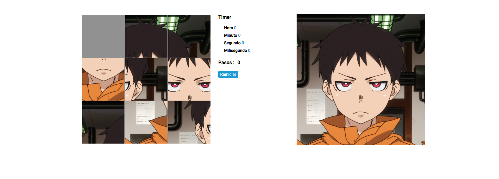
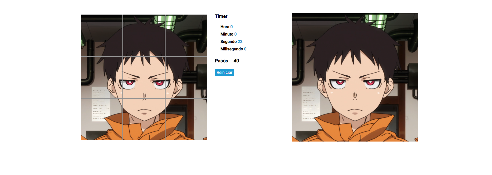

# Puzzle.js
Aleatoridad al `recargar` la pagina o reiniciar con un boton




> html
```html
    <div id="game">
        
    </div>
    <script src="puzzle.js"></script>
```
> css ( en este caso scss )

    es necesario asignar el ancho al contenedor (solo el ancho)
```css
#game {
    width:500px;
    position: relative;
    img{
        opacity: 0;
    }
    span {
        display: inline-block;
        cursor: pointer;
        transition: all 300ms ease;
        position: absolute;
        background-repeat: no-repeat;
        &.hidden {
            opacity: 0 !important;
        }

    }
}
```
> javascript
```js
new Puzzle('game', {
    maxCols: 3,
    margin: 3,
    viewSteps: true,
    timer: true,
    winAction: (data) => {
        const { steps, time } = data;
        const { hours, minutes, seconds, ms } = time;
        console.log(`he ganado con solo ${steps} pasos y con ${hours} horas , ${minutes} minutos , ${seconds} segundos y ${ms} milisegundos`);
    }
})
```
> opciones

| propiedad | por defecto | descripcion |
|------|------|-------|
| **id** | ' ' | id del contenedor , **no opcional** |
| **maxCols** | 3 | maximo de las columnas ej. 3 = 3x3 columnas |
| **margin** | 3 | margen se separacion entre los elementos |
| **viewSteps** | false | visualizar los movimientos ( contador de moviemientos ) |
| **timer** | false | mostrar el tiempo de juego |
| **winAction** | false | funcion para ejecutar una vez termine el juego |


